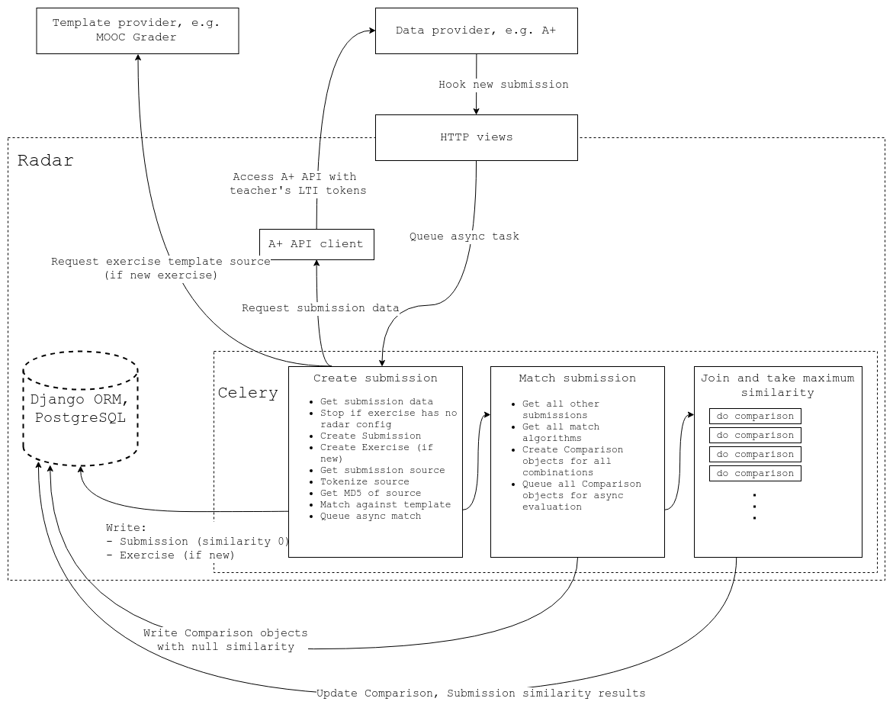

This package contains the core functionality required for comparing submissions to each other and producing similarity scores for the compared pairs.
Submissions are matched in parallel with Celery by using the tasks defined in `tasks.py`.

Here is an approximate sketch of what happens during matching:

